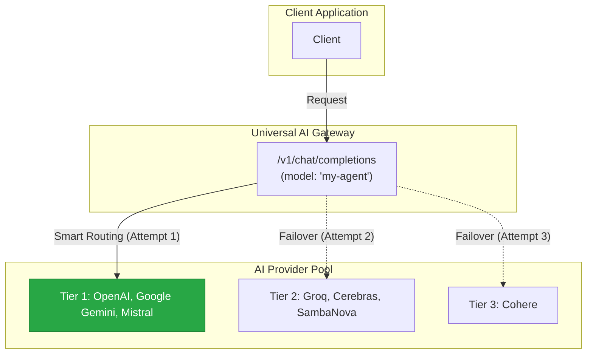
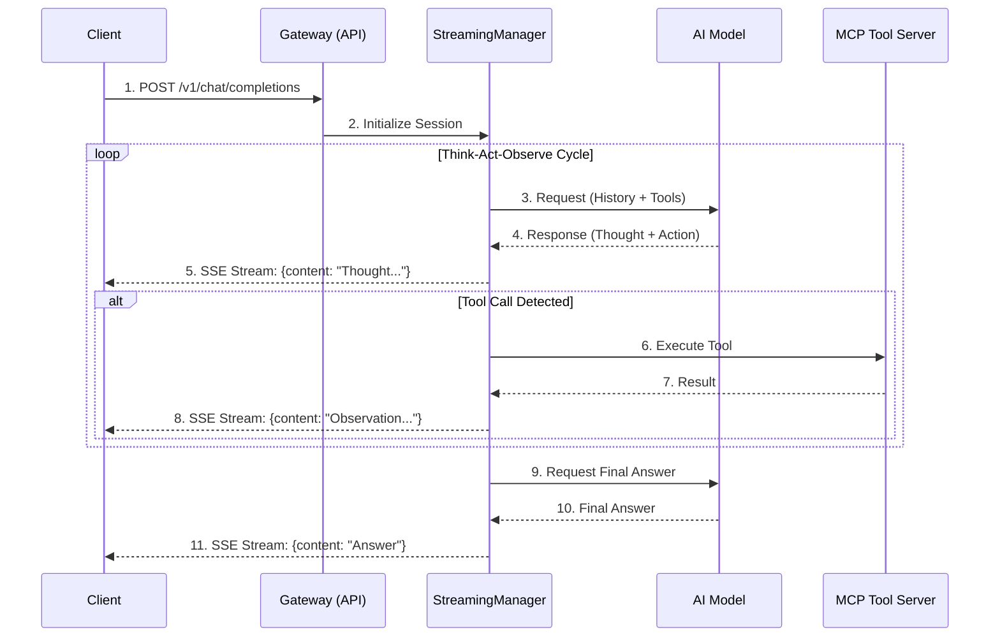

<div align="center">
  
  <h1>Universal AI Gateway</h1>
  <h3>(Previously "Magic Proxy")</h3>
  <p>
    
    
    
  </p>
</div>

**Universal AI Gateway** is a high-performance, fault-tolerant orchestration platform for Large Language Models (LLMs), designed to evolve into a complete **AI Art Studio & Ecosystem**.

Unlike simple API proxies that merely forward requests, this gateway acts as an **Agent Operating System**. It transforms standard model calls into deeply reasoned, structured sessions ("Cognitive Enrichment"), enables even basic models to solve complex problems through ReAct loops, and standardizes interactions across diverse providers like Google, OpenAI, Mistral, Groq, and Cerebras.

## Table of Contents
- [Key Features](#key-features)
- [Architecture](#architecture)
- [How It Works (Visualized)](#how-it-works-visualized)
- [Documentation Navigator](#documentation-navigator)
- [Installation & Running](#installation--running)
- [Integration & Usage](#integration--usage)
- [Configuration (DSL)](#configuration-dsl)
- [License](#license)

## Key Features

*   **Cognitive Enrichment Engine**: Implements advanced reasoning patterns (ReAct, Cognitive Ladder, Reflexion), allowing models to iteratively "think," call external tools, and self-correct.
*   **High-Availability Routing**: A sophisticated Round-Robin rotation system that manages pools of API keys and models, ensuring seamless failover and maximum uptime.
*   **Universal Tool Server (MCP)**: Connect any "hands"—external APIs, internal functions, or other agents—via the standard Model Context Protocol (MCP).
*   **Smart Search Swarm**: An integrated Map-Reduce search engine that breaks down queries, executes parallel searches, and synthesizes comprehensive answers with visual progress notifications.
*   **Python DSL Configuration**: A powerful, dynamic configuration system (`core/config/`) that replaces static YAML files with programmable Python dictionaries, enabling automatic agent mutation and inheritance.
*   **Advanced Recovery**: Automatically detects and fixes provider errors (e.g., extracting data from "400 Bad Request" payloads), turning failures into successes.
*   **Zero-Config Discovery**: Simply drop a new agent or model definition file into the config directory, and the system automatically loads it.

## Architecture

The project is built as a modular Python application:

1.  **Main Gateway (`main.py`)**: The FastAPI entry point. Handles routing, authentication, and lifecycle.
2.  **Streaming Manager (`core/engine/manager.py`)**: The "brain" of the system. Manages the Think-Act-Observe loop, orchestrates tools, and handles the streamed response.
3.  **DSL Configuration (`core/config/`)**: The definitive source of truth for Agents, Models, and Tiers.
4.  **Rotation Manager (`core/providers/rotation_manager.py`)**: Ensures load balancing across model tiers.
5.  **MCP Manager (`core/mcp/client.py`)**: Manages connections to external MCP tool servers.

## How It Works (Visualized)

### 1. High-Level Interaction: The Proxy as a Black Box


### 2. Internal Flow: ReAct Engine Request


## Documentation Navigator

For a deeper understanding of each component, please refer to the detailed technical documentation in `docs/`:

*   **[Introduction](./docs/INTRODUCTION.md)**: High-level vision and roadmap.
*   **[Configuration Guide](./docs/CONFIGURATION_GUIDE.md)**: How to define Agents and Models using the Python DSL.
*   **[User Config Guide](./docs/USER_CONFIG_GUIDE.md)**: User-specific overrides and MCP Tool Management.
*   **[DSL Reference](./docs/DSL_REFERENCE.md)**: Technical deep-dive into the configuration engine internals.
*   **[ReAct Engine](./docs/REACT_ENGINE.md)**: Deep dive into the reasoning loop and patterns.
*   **[Smart Search](./docs/SMART_SEARCH.md)**: Guide to the Swarm Search tool and notification system.
*   **[Architecture & Roadmap](./docs/ARCHITECTURE_AND_ROADMAP.md)**: Future plans for the Art Studio ecosystem.
*   **[Integration Guide](./docs/INTEGRATION_GUIDE.md)**: Connecting external apps (VS Code, Cursor, OpenWebUI).
*   **[Performance Optimization](./docs/PERFORMANCE_OPTIMIZATION.md)**: Caching and latency tuning.

## Installation & Running

This project uses [Poetry](https://python-poetry.org/) for dependency management and Docker for infrastructure.

### 1. Prerequisites
- Docker & Docker Compose
- Python 3.10+ (optional, for local dev)

### 2. Environment Setup
1.  **Configure `.env`**:
    Copy the template or create a `.env` file in the project root. You must define `DOCKER_USERNAME` and `DOCKER_ACCESS_TOKEN` for infrastructure setup.
    ```bash
    DOCKER_USERNAME=your_user
    DOCKER_ACCESS_TOKEN=your_token
    ```

2.  **Initialize Infrastructure**:
    Run the setup script to provision Redis, Kafka, and MongoDB containers.
    - **Linux/macOS:** `chmod +x setup_infra.sh && ./setup_infra.sh`
    - **Windows:** `setup_infra.bat`

### 3. Running the Application

#### Option A: Run Locally (Python)
Ideal for development and debugging.
- **Linux/macOS:** `./run/run_server.sh`
- **Windows:** `run\run_server.bat`

#### Option B: Run in Docker
Runs the application as a container in the shared network.
- **Linux/macOS:** `./run_docker_app.sh`
- **Windows:** `run_docker_app.bat`

The server will start at `http://localhost:8001`.

## Integration & Usage

Universal AI Gateway is fully compatible with the OpenAI API protocol.

1.  **Register a User:** Send a POST to `/v1/auth/register` to get an API Key.
2.  **Configure Client:** Point your app (Cursor, LibreChat, etc.) to `http://localhost:8001/v1` and use your API Key.

See the **[Integration Guide](./docs/INTEGRATION_GUIDE.md)** for detailed instructions.

## Configuration (DSL)

All configuration is code-based and lives in `core/config/`.

*   **Agents:** Defined in `core/config/agents/` (e.g., `standard_agent.py`).
*   **Models:** Defined in `core/config/base/` (e.g., `vision_models.py`).
*   **Patterns:** Defined in `react_patterns/`.

To add a new agent, simply create a new `.py` file in the agents directory with a configuration dictionary. No server restart is required for changes to take effect if using debug mode/autoreload.

## License

This project is licensed under the **GNU Affero General Public License v3.0 (AGPL v3.0)**.

*   **Free Use:** You are free to use, modify, and distribute this software, provided that any modifications (including those used in a SaaS environment) are also open-sourced under the same license.
*   **Commercial Use:** If you wish to use this software for commercial purposes (including SaaS) **without** open-sourcing your code, you must obtain a commercial license.

For commercial licensing inquiries or to discuss partnership opportunities, please contact me:

*   **Telegram:** [@Lotargo](https://t.me/Lotargo)

---
<div align="center">
  <i>Per aspera ad astra</i>
</div>
