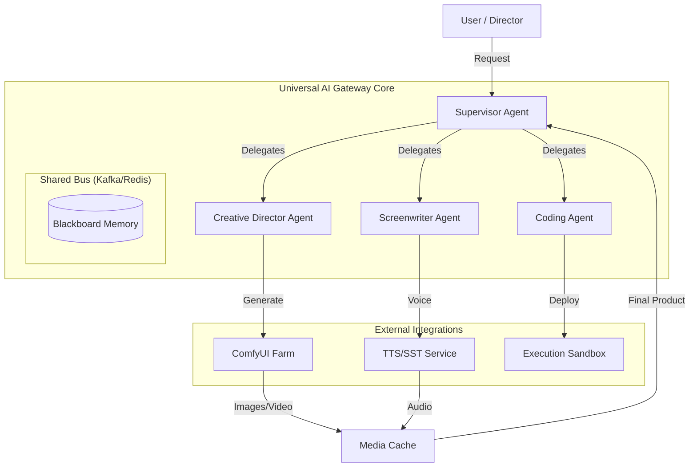
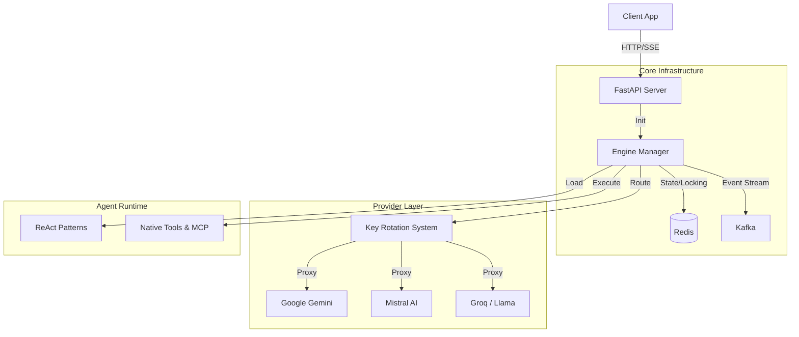

# Architecture & Roadmap

## 🌟 Project Vision & Status

Universal AI Gateway is evolving from a robust LLM gateway into a comprehensive **AI Ecosystem and "Art Studio"**. The goal is to create a unified platform where specialized agents (Text, Code, Vision, Audio) collaborate to produce complex creative and technical outputs, orchestrating external tools like ComfyUI and coding environments autonomously.

---

## 🗺️ Functional Roadmap (Strategic Vision)

This section outlines the active development goals focused on expanding the system's cognitive capabilities and integration ecosystem.

### 🧠 Cognitive Architectures (Agent Patterns)

We are systematically implementing advanced reasoning patterns to allow agents to handle increasingly complex tasks.

| Pattern | Status | Implementation Details |
| :--- | :--- | :--- |
| **ReAct** (Reason+Act) | ✅ **Live** | Implemented as `simple_react`. The foundational logic for tool use. |
| **Reflexion** | ✅ **Live** | Implemented as `analytical_react`. Follows a "Draft → Critique → Refine" loop to self-correct errors. |
| **Cognitive Ladder** | ✅ **Live** | Implemented as `linear_react`. A unique 12-step deep reasoning pipeline ("Resonance" to "Transcendence") for complex analysis. |
| **Hierarchical** (Boss-Worker) | 🔄 **Partial** | Foundation exists via `call_worker_agent`. Allows an agent to delegate tasks to another agent instance. |
| **Map-Reduce** | 📅 **Planned** | Parallel processing of sub-tasks followed by a synthesis step. |
| **Self-Consistency** | 📅 **Planned** | Generating multiple reasoning paths and selecting the most consistent answer (Majority Vote). |
| **Multi-Persona Debate** | 📅 **Planned** | Simulating a dialogue between different personas (e.g., "Skeptic" vs. "Optimist") to reach a balanced conclusion. |
| **Plan-and-Solve** | 📅 **Planned** | Explicit separation of a "Planning Phase" (generating a full roadmap) before any execution begins. |
| **Tree of Thoughts (ToT)** | 📅 **Planned** | Exploring multiple reasoning branches with backtracking capabilities. |
| **Chain of Verification (CoVe)** | 📅 **Planned** | Generating a response, then generating verification questions to test its factual accuracy, followed by correction. |
| **Blackboard Pattern** | 📅 **Planned** | A shared memory space where multiple specialized agents can read and write data asynchronously. |

### 🎨 Creative Ecosystem ("The Art Studio")

We are building an automated pipeline for high-fidelity content creation.

*   **ComfyUI Integration:** Direct control over ComfyUI workflows for generation of:
    *   Images (High coherence)
    *   Video (Short films, animations)
    *   Audio (Soundscapes)
*   **TTS/SST Engine:** Text-to-Speech and Speech-to-Text integration to give agents voice capabilities.
*   **Supervisor/Worker System:** A fully hierarchical multi-agent system where a "Supervisor" agent orchestrates creative tasks, delegating asset generation to specialized "Artist" agents.
*   **Coding Agent:** A specialized autonomous developer agent capable of writing, testing, and deploying code (similar to the Jules platform).

#### Future Ecosystem Architecture

---

## 🏛️ Current Architecture (High-Level)

The current architecture is a monolithic but highly modularized Python application designed for fault tolerance.

---

## 🔧 Technical Foundation & Maintenance

While the functional roadmap is the priority, we maintain a list of technical debt and infrastructure improvements to ensure the platform scales with its new capabilities.

*   **Decomposition:** Split the `core/api/server.py` monolith into modular bootstrappers (`core/bootstrap/`).
*   **Validation:** Migrate configuration dictionaries to Pydantic models for stricter validation.
*   **Security:** Harden CORS settings and implement strict tenant isolation.
*   **Optimization:** Expand semantic caching (Redis) to all providers, not just Gemini.
