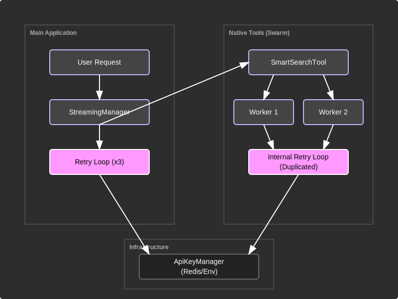
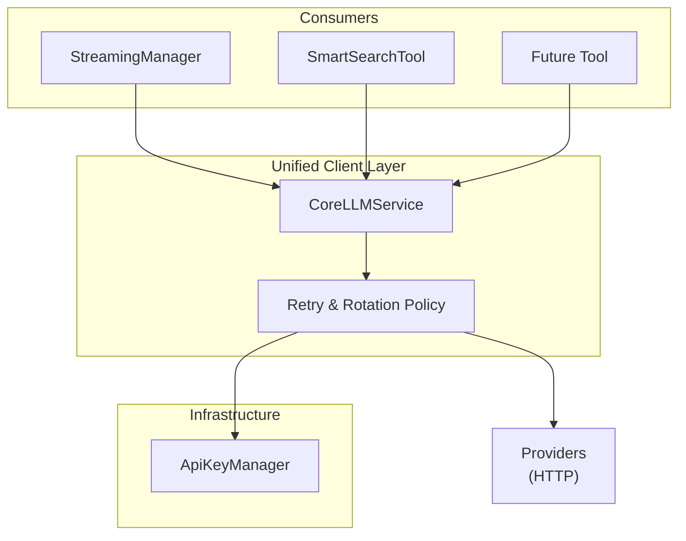

# Architectural Limitations & Roadmap

## Overview: LLM Client Logic Duplication

Currently, the **Universal AI Gateway** employs a split architecture for executing LLM requests. While the infrastructure layer (Key Management) is unified, the **execution client logic** (retries, error handling, provider switching) is duplicated across different components.

This document describes the current limitation, its reasons, and the roadmap for refactoring.

### The Problem

We have two distinct "engines" that interact with LLM Providers:
1.  **StreamingManager (`core/engine/manager.py`):** Handles the main user conversation, ReAct agents, and linear interactions. It has its own robust retry and rotation logic.
2.  **Native Tools (e.g., `SmartSearchTool` in `core/tools/native/smart_search.py`):** Independent "Swarm" or "Map-Reduce" tools that run parallel sub-tasks. These implement their own lightweight internal retry loops (`_call_model`), duplicating the logic found in `StreamingManager`.

**Risks:**
-   **Desynchronization:** A bug fix or policy change (e.g., "retry 3 times instead of 1") applied to the main chat might be missed in the tools, leading to inconsistent behavior (as seen in the 429 rotation bug).
-   **Maintenance Overhead:** New tools require copy-pasting the error handling boilerplate.

---

### Current Architecture

Currently, both the Session Manager and individual Tools interact directly with the `ApiKeyManager` and implement their own `try/except` loops for handling 429 errors.

### Target Architecture (Roadmap)

To resolve this, we propose introducing a **Unified LLM Service** (Client Layer). This service will encapsulate the retry policies, key rotation, and provider fallback logic. Both the linear `StreamingManager` and parallel `Native Tools` will consume this service.

### Developer Guidance (Until Refactor)

If you are adding a new Native Tool that requires LLM calls (e.g., a new Map-Reduce agent):

1.  **Be Aware:** You cannot easily reuse `StreamingManager` inside a tool due to circular dependencies and state overhead.
2.  **Copy Carefully:** You will need to implement a local `_call_model` method similar to `SmartSearchTool`.
3.  **Sync Policies:** Ensure your local retry loop matches the global standard:
    -   **Max Retries:** At least 3 attempts per provider.
    -   **429 Handling:** Wait/Backoff before switching models.
    -   **Key Usage:** Rotate keys on the same provider before failing over to a fallback provider.
