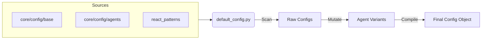
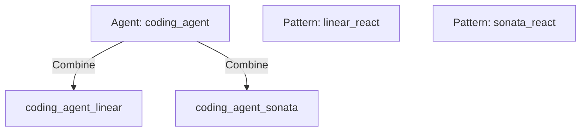

# DSL Reference Guide

This document provides a technical deep-dive into the **Domain Specific Language (DSL)** used in Universal AI Gateway. While `CONFIGURATION_GUIDE.md` explains *how to configure* the system, this guide explains *how the configuration engine works under the hood*.

Target Audience: Core Developers, Contributors, and Power Users who want to extend the engine.

---

## 1. The Configuration Engine (`core/config/default_config.py`)

The heart of the DSL is `core/config/default_config.py`. Unlike static configuration loaders (JSON/YAML), this module acts as a **dynamic compiler**. It executes the following pipeline at startup:

1.  **Base Scanning**: Scans `core/config/base/` for low-level definitions (Models, Tiers, Providers).
2.  **Pattern Discovery**: Scans `react_patterns/` for reasoning logic.
3.  **Agent Loading**: Scans `core/config/agents/` for high-level profiles.
4.  **Mutation Generation**: Combines Agents + Patterns to create combinatoric variants.
5.  **Router Compilation**: Resolves abstract Tiers into concrete Model Lists.



---

## 2. Agent DSL (`core/config/agents/*.py`)

Agents are defined as Python modules exporting a global `AGENT_CONFIG` dictionary.

### Schema

```python
AGENT_CONFIG = {
    "name": "str",              # Unique internal ID (e.g., "coding_agent")
    "description": "str",       # Human-readable description
    "aliases": ["str", ...],    # External aliases (e.g., "coder")

    # Model Configuration (The "Body")
    "model_config": {
        "provider": "openai",   # Default provider
        "model": "gpt-4o",      # Default model ID
        "temperature": float,   # (Optional) Default temp
    },

    # Agent Personality (The "Mind")
    "settings": {
        "agent_settings": {
            "reasoning_mode": "str",  # Links to a Pattern (e.g., "linear_react")
            "tool_choice": "auto",    # "auto" | "any" | "none"
            "allowed_tool_servers": ["str", ...] # List of MCP/Native tools
        }
    },

    # Routing Strategy (The "Resilience")
    "router_config": {
        "main": ["str", ...],      # Primary chain (Models or Tiers)
        "fallbacks": ["str", ...]  # Fallback chain (Models or Tiers)
    }
}
```

### Key Concepts
*   **Router Config**: This is where you define reliability.
    *   **Direct Model**: `"main": ["gpt-4o"]` (Simple)
    *   **Tier Reference**: `"main": ["vision_tier_1"]` (Load Balanced). The engine resolves `vision_tier_1` from `core/config/base/*_models.py` into a list of concrete models.
    *   **Mixed**: `"main": ["gpt-4o", "claude-3-opus"]` (Specific sequence).

---

## 3. Pattern DSL (`react_patterns/*.py`)

Patterns define the **Prompt Engineering** logic. They are Python modules that must export a specific function.

### Contract

```python
from typing import Dict

def get_prompt_structure() -> Dict[str, str]:
    """
    Returns the template for this reasoning mode.
    """
    return {
        # 1. Static System Prompt
        # This is the immutable core instruction.
        # It supports placeholders like {system_instruction} (from Agent Config).
        "static_system": """You are an AI... {system_instruction}...""",

        # 2. Dynamic Context
        # This is injected into the conversation stream (e.g., as the first User message)
        # to provide real-time state without breaking prompt caching.
        # Supports: {tools_list_text}, {tool_instructions}, {current_date}, etc.
        "dynamic_context": """CONTEXT:\n{tools_list_text}..."""
    }
```

### Placeholders
The engine automatically injects the following values into the templates at runtime (via `NativeDriver` or `StreamingManager`):
*   `{tools_list_text}`: JSON/Text definition of available tools.
*   `{tool_instructions}`: Guide on how to use the tools (native vs XML).
*   `{server_status_text}`: Health status of MCP servers.
*   `{current_date}`: UTC timestamp.
*   `{draft_context}`: Content of the scratchpad/notebook (for ReAct).

---

## 4. Model DSL (`core/config/base/*_models.py`)

These files define the infrastructure layer. The loader looks for dictionaries ending in `_TIERS`.

### Schema

```python
# core/config/base/coding_models.py

# A Tier is simply a list of strings.
# Strings can be:
# 1. Concrete Model IDs ("openai/gpt-4o")
# 2. Provider Aliases ("gemini-pro")
CODING_TIERS = {
    "coding_tier_1": [
        "claude-3-5-sonnet-20240620",
        "gpt-4o-2024-05-13"
    ],
    "coding_tier_fast": [
        "groq/llama-3-70b",
        "cerebras/llama-3-70b"
    ]
}
```

---

## 5. Automatic Mutations

The loader (`core/config/default_config.py`) performs a combinatorial generation step called "Mutations".

**Logic:**
1.  Iterate over all loaded **Agents** (e.g., `standard`, `coding`).
2.  Iterate over all discovered **Patterns** (e.g., `linear`, `sonata`).
3.  If the Agent is not in `MUTATION_EXCLUSION_LIST`:
    *   Clone the Agent Config.
    *   Override `agent_settings.reasoning_mode` with the Pattern.
    *   Register a new Agent Variant: `{agent_name}_{pattern_name}`.



**Example:**
*   Input: `coding_agent` + `linear_react` pattern.
*   Output: `coding_agent_linear` (Accessible via API as a distinct model/agent).

This allows you to define the *Capability* (Coding) once, and access it with different *Thinking Styles* (Fast vs Deep) automatically.
