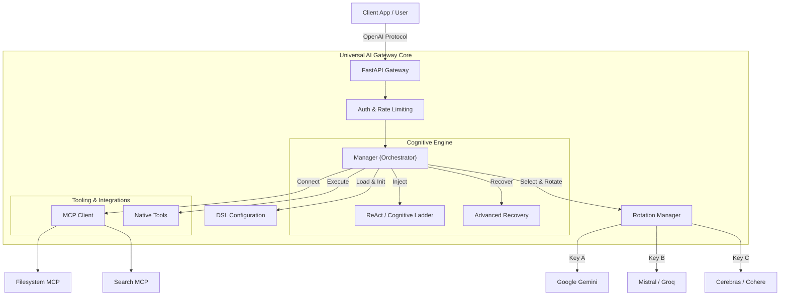

# Introduction to Universal AI Gateway

**Universal AI Gateway** (formerly *Magic Proxy*) is a high-performance, fault-tolerant orchestration platform for Large Language Models (LLMs), designed to evolve into a complete **AI Art Studio & Ecosystem**.

Unlike simple API proxies that merely forward requests, the Gateway acts as an **Agent Operating System**. It provides a robust runtime environment that handles the complexities of LLM interactions—authentication, rate limiting, error recovery, and cognitive architecture—while preparing the ground for autonomous creative production.

## 🚀 Vision: From Gateway to Art Studio

The project began as a "Cognitive Prism" to overcome rate limits and enforce reasoning. It is now expanding into a comprehensive ecosystem that:

1.  **Unifies Intelligence:** Orchestrates diverse models (Google, Mistral, OpenAI, Groq, Cerebras) into a cohesive brain.
2.  **Enforces Reliability:** Implements "self-healing" mechanisms (Rotation, Recovery, Reflexion) to make unreliable models production-ready.
3.  **Standardizes Cognition:** Provides built-in "reasoning patterns" (ReAct, Cognitive Ladder, Reflexion) that work across models of varying intelligence.
4.  **Empowers Creativity (Coming Soon):** Serves as the backbone for an autonomous **Art Studio**, integrating ComfyUI, TTS, and Video Generation to allow agents to direct and produce multimedia content.

## 🏗️ High-Level Architecture

The Gateway sits between your client application (e.g., OpenWebUI, custom frontend) and the external AI providers/tools.

## ✨ Key Features

### 1. The "DSL" Configuration Engine
The system uses a **Python-based Domain Specific Language (DSL)** for configuration. Instead of static YAML files, agents and models are defined as Python objects. This allows for:
*   **Dynamic Discovery:** Simply drop a file into `core/config/agents/`, and the system automatically registers the agent.
*   **Automatic Mutations:** Defining one agent (e.g., `standard_agent`) automatically spawns variations like `standard_agent_linear` and `standard_agent_sonata`.

### 2. Resilient ReAct Engine
The system implements a highly robust ReAct (Reasoning + Acting) loop designed to handle "messy" reality:
*   **Fuzzy JSON Parsing:** Can extract valid tool calls even if the model surrounds them with conversational text.
*   **Advanced Recovery:** Intercepts `400 Bad Request` errors from providers (like Groq), extracts the `failed_generation` payload, and manually executes the intended tool, turning a fatal error into a successful step.

### 3. Smart Caching & Optimization
To maximize performance and minimize costs:
*   **Native Context Caching (Gemini):** Utilizes Google's specific API to cache massive system prompts and conversation history.
*   **Prefix Caching (Universal):** Optimizes prompt structure to leverage implicit prefix caching on providers like Mistral.
*   **Media Pipeline:** Automatically routes image uploads to the most efficient storage (Native File API for Google, Cloudinary for others).

### 4. Key & Model Rotation
A sophisticated "Round-Robin" system that manages pools of API keys and models. It ensures that if one key hits a rate limit, the system seamlessly switches to the next, providing the illusion of unlimited throughput.

---
*Proceed to [Getting Started](./GETTING_STARTED.md) to install and run the system.*
