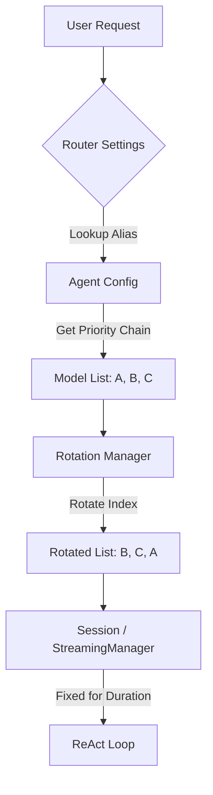
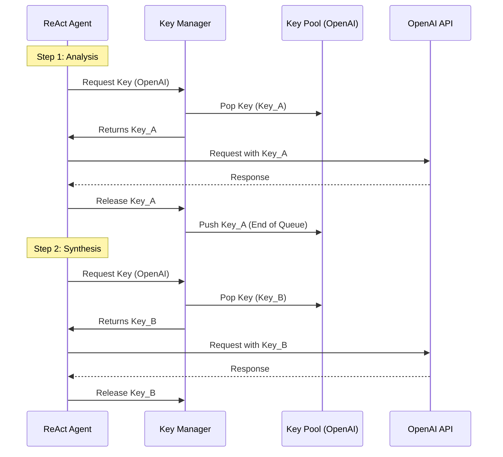

# Load Balancing & Key Rotation Strategy

This document outlines the load balancing and resource management strategies employed by the Universal AI Gateway architecture. The system uses a multi-layered approach to ensure high availability, equitable resource usage, and robustness against provider rate limits.

## 1. Model Load Balancing (The "Router" Layer)

The first layer of balancing happens at the point of receiving a user request (`/v1/chat/completions`). This determines *which* model configuration handles the entire session (or request).

### Aliases vs. Specific Models

There are two primary ways models are addressed:

1.  **Direct Aliases (Transparent)**:
    *   **Example**: `standard_agent` (referencing `["openai/gpt-oss-120b", "google/gemini-flash"]`).
    *   **Behavior**: When a user selects `standard_agent`, they are selecting a fixed configuration. The load balancing happens *internally* if the agent's definition contains a list of models. The system will try them in order (Main -> Fallbacks).
    *   **Rotation**: The system rotates the **starting point** of this list for every new incoming request (Round Robin).

2.  **Specific Model Names**:
    *   **Example**: `["openai/gpt-oss-120b", "google/gemini-flash"]` defined explicitly in a router chain.
    *   **Behavior**: The `rotation_manager` rotates the priority list *before* the session starts.
    *   **Per-Request Consistency**: Once a session (e.g., a ReAct loop) starts, the **Priority Chain is fixed** for that session.
        *   Request 1: Uses Model A.
        *   Request 2: Uses Model B.
        *   *Inside Request 1 (ReAct Steps)*: All steps use Model A (unless it fails and falls back to B).

### Logic Flow

## 2. Key Rotation (The "Resource" Layer)

The second layer works at the level of **API Credentials**. This logic is completely decoupled from the Model Logic.

### Granularity: Per-Step, Not Per-Session

A critical distinction in this architecture is that API keys are rotated on a **per-LLM-call basis**, even within a single session.

*   **Scenario**: A ReAct agent performs a task requiring 3 steps (Think -> Act -> Think).
*   **Step 1**: The system requests a key for `openai`. `KeyManager` provides `Key_001`. The request finishes. `Key_001` is returned to the pool.
*   **Step 2 (Tool)**: No LLM call.
*   **Step 3**: The system requests a key for `openai`. `KeyManager` provides `Key_002` (since `Key_001` is now at the back of the queue).

### Provider Pools

Keys are managed per **Provider** (e.g., `openai`, `google`, `mistral`), not per model.
*   `gpt-4o` and `gpt-3.5-turbo` share the same `openai` key pool.
*   This ensures that a heavy load on one model type distributes the "cost" (rate limits/quotas) across all available keys for that provider.

### Quarantine Logic
If a key triggers a specific error (e.g., 429 Rate Limit), it is moved to a temporary **Quarantine** and removed from rotation for a set duration (e.g., 5 minutes), allowing it to "cool down".

## Summary

| Feature | Scope | Mechanism | Purpose |
| :--- | :--- | :--- | :--- |
| **Model Balancing** | Per Session (User Request) | Priority Chain Rotation | Distribute traffic across different model backends/providers. |
| **Key Balancing** | Per Step (LLM Call) | Shared Provider Queue (FIFO/Random) | Distribute API usage across multiple accounts/keys to avoid Rate Limits. |
