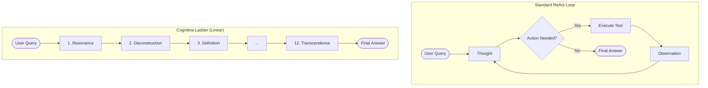

# The ReAct Engine

The heart of Universal AI Gateway is its **Resilient ReAct Engine**. It is not just a standard "Reason-Act" loop; it is a battle-hardened runtime designed to extract high-quality reasoning from imperfect models.

## 🧠 Cognitive Architectures

The Engine supports multiple "reasoning patterns" that define how an agent thinks. These patterns are defined in `react_patterns/*.py` using the Pattern DSL (see [DSL Reference](./DSL_REFERENCE.md)). They map to advanced academic concepts in AI research.

### 1. Simple ReAct (`simple_react`)
*   **Concept:** **ReAct (Reason + Act)**.
*   **Description:** The standard pattern. The model iterates through `Thought`, `Action`, `Observation`.
*   **Best For:** Simple tasks, direct tool usage, fast responses.

### 2. Cognitive Ladder (`linear_react`)
*   **Concept:** **Linear Chain of Thought / Deep Reasoning**.
*   **Description:** A unique pattern that forces the model through a mandatory 12-step intellectual journey before it is allowed to answer. It forbids tool usage to focus purely on internal reasoning.
*   **Phases:** Resonance -> Deconstruction -> Contextualization -> ... -> Transcendence.
*   **Best For:** Philosophy, complex writing, ethical analysis, and making small models (7B) sound like large models (70B).

### 3. Analytical Reflexion (`analytical_react`)
*   **Concept:** **Reflexion (Self-Correction)**.
*   **Description:** Implements a "Draft -> Critique -> Refine" loop. The agent produces an initial thought, criticizes it for flaws, and then synthesizes a better version.
*   **Best For:** Coding, math, and tasks requiring high accuracy.

### 4. Sonata (`sonata_react`)
*   **Concept:** **Structured Synthesis**.
*   **Description:** A balanced "Analysis -> Strategy -> Synthesis" loop.
*   **Best For:** General-purpose complex problem solving.

## 📊 Visualizing the Logic

### Standard ReAct vs. Cognitive Ladder



## 🛡️ Robustness Features

Real-world LLMs are messy. They hallucinate, break JSON syntax, and return API errors. The Engine is built to survive this.

### 1. Advanced Recovery (The "Groq Hack")
**Scenario:** You ask a Groq/Llama model to use a tool. The provider returns `400 Bad Request` because the model outputted invalid JSON or violated a schema.

**Standard Behavior:** The application crashes.

**Gateway Behavior:**
1.  Intersects the `400` error.
2.  Parses the error message body to find the `failed_generation` field.
3.  Extracts the intended JSON or text from the error report.
4.  **Manually executes the tool** or inserts the text into the agent's memory.
5.  Resumes the loop as if nothing happened.

*Result:* The user never sees the crash. The agent "self-heals."

### 2. Fuzzy JSON Parsing
Models often wrap JSON in Markdown blocks, conversational text, or random characters:

> "Here is the tool call you wanted: ```json {"tool": "search"} ``` I hope this helps!"

The **Fuzzy Parser** in `manager.py` uses a bracket-balancing algorithm to locate and extract the valid JSON object buried inside the noise, ensuring the tool call succeeds.
