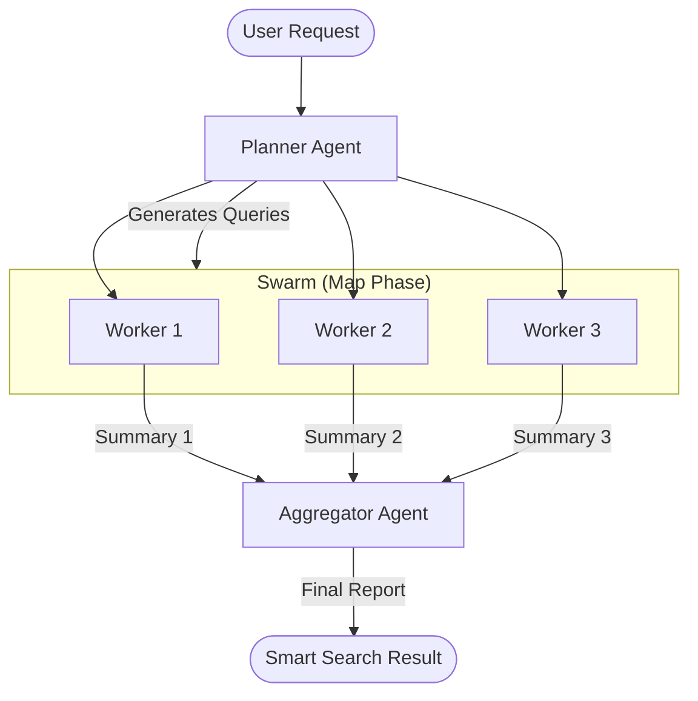
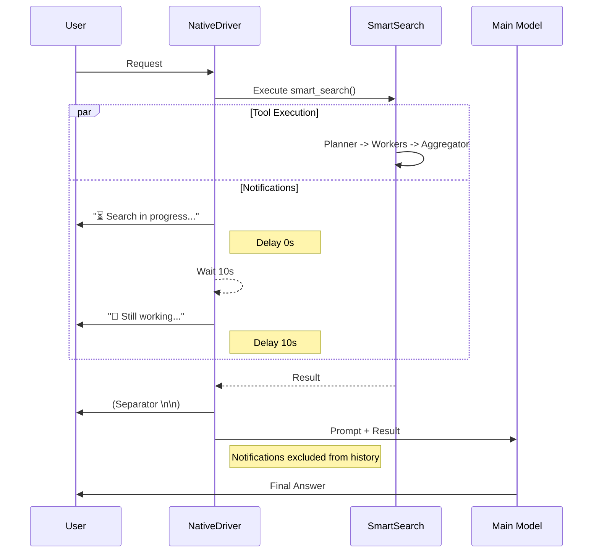
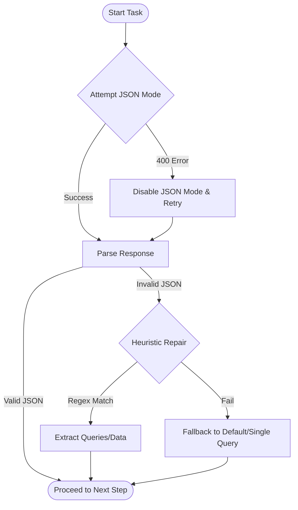

# Smart Search Tool

## Overview
**Smart Search** is an advanced retrieval tool integrated into the Universal AI Gateway Native Driver. Unlike standard Google Search, which performs a single query, Smart Search utilizes a **Swarm / Map-Reduce** architecture to provide comprehensive, deep-dive answers.

## Architecture
The tool operates in three stages:

1.  **Planner**: The system analyzes the user's request and generates multiple distinct search queries (up to 3) to cover different aspects of the topic.
2.  **Workers (Map)**: Each query is executed in parallel.
    *   The worker performs a Google Search.
    *   A fast "Worker Model" (e.g., Groq/Llama-3, Cerebras, or Gemini Flash) reads the search results and summarizes the key facts.
3.  **Aggregator (Reduce)**: A final "Editor" model compiles all worker summaries into a single, coherent report, eliminating duplicates and ensuring flow.

This approach ensures that the final context provided to the main Agent is rich, fact-checked, and covers multiple perspectives.



## Date Awareness & Temporal Relevance
To ensure the search results are not only comprehensive but also **current**, the system automatically injects the **current date and time (UTC)** into the context of every agent in the swarm (Planner, Workers, Aggregator).

### Mechanism
1.  **Injection:** At the start of execution, the system captures `get_current_datetime_str()`.
2.  **Planner:** Uses the date to formulate query timeframes (e.g., "iphone price 2024" vs "iphone price 2025").
3.  **Workers:** Use the date to assess the freshness of search results.
4.  **Aggregator (Critical Step):** Received a specific instruction to perform **Temporal Relevance Verification**.
    *   If the user's query implies a specific timeframe (e.g., "upcoming movies 2025"), the Aggregator is strictly instructed to reject or qualify data that does not match this period.
    *   This prevents the common "hallucination of the present" where models present outdated data (e.g., 2023) as current facts.

## Configuration

### Enabling Smart Search
Smart Search is controlled by the `ENABLE_SMART_SEARCH` flag in the main configuration.
When enabled, the `NativeDriver` automatically hides basic `google_search` and `web_search` tools from the model and exposes `smart_search` instead. This forces the model to use the swarm architecture for all web retrieval tasks.

### Waiting Notifications
Since Smart Search involves multiple model calls and network requests, it can take longer than a standard tool (10-30 seconds). To improve user experience, the system implements an **Automatic Notification System**.

*   **Behavior**: The system sends periodic status messages to the chat stream while the tool is running.
*   **Context Isolation**: These messages are **visual-only**. They are displayed to the user but are **strictly excluded** from the conversation history sent to the LLM. This prevents "context pollution" and reduces cognitive load on the model.
*   **Formatting**: Messages are formatted as Markdown blockquotes (`> Message`) and separated by newlines to ensure clean rendering.



#### Configuring Messages
The notification messages and their timing are defined in `core/config/waiting_messages.py`.

```python
SMART_SEARCH_WAITING_MESSAGES = [
    {
        "delay": 0,
        "message": "\n\n> ⏳ Search in progress..."
    },
    {
        "delay": 10,
        "message": "\n\n> 🔄 Still working..."
    }
]
```

*   `delay`: Time in seconds to wait before sending the message (relative to the previous step).
*   `message`: The text to display.

## Technical Implementation
*   **Location**: `core/tools/native/smart_search.py`
*   **Driver Integration**: `core/engine/native_driver.py` handles the execution loop and the background notification task.
*   **Worker Models**: Defined in the `WORKER_MODELS` list in `smart_search.py`. The system randomly selects available fast models to distribute load.

## Resilience & Compatibility
To ensure stability across a wide range of models (including "weak" or stricter models like Gemma or Llama 3 8B on specific providers), Smart Search implements robust fallback mechanisms.

### 1. JSON Mode Fallback
Some providers or models return `400 Bad Request` errors when `json_mode` is requested but not fully supported.
*   **Detection**: The system catches HTTP 400 errors containing "json mode" or "invalid_argument" messages.
*   **Action**: It automatically retries the request with **JSON Mode DISABLED**.
*   **Parsing**: To handle the resulting output (which may be Markdown-wrapped), the system uses a robust `_clean_json_string` helper to extract the raw JSON.

### 2. Planner Heuristic Repair
If a weak model fails to produce valid JSON even in text mode (e.g., missing commas), the Planner step has a self-healing mechanism:
*   **Heuristic**: It uses Regex to find list patterns (`["a", "b"]`) in the text.
*   **Recovery**: It extracts quoted strings directly, allowing the search to proceed with multiple parallel queries instead of falling back to a single generic query.

### Reliability Flow


